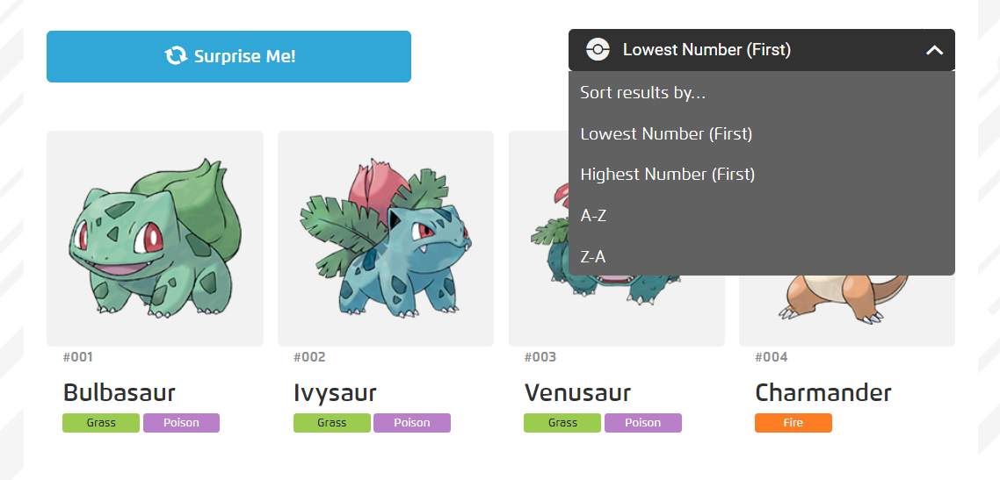

# ajax_pokedex
A javascript Ajax project.

## Learning Objectives
* A typical AJAX flow: send asynchronous requests to a remote server and process the results;
* DOM manipulation: changing the DOM based on results of AJAX-requests.

## Exercise
Make a [Pokédex](https://www.google.com/search?q=pokedex&source=lnms&tbm=isch&sa=X&ved=0ahUKEwiRtNT3-vDfAhWDy6QKHd1cBD4Q_AUIDigB&biw=1300&bih=968#imgrc=_) using [Pokeapi](https://pokeapi.co/).

## Goals
* Send an ajax request to remote server.
* In response must receive a pokemon data. (using name and Id)
* Search a pokémon by name and by ID
* Display the response in DOM with below information:
    * The ID-number
    * An image (sprite)
    * _At least_ 4 "moves"
    * The previous evolution
    * Using CSS make webpage look like pokedex
    
        - display list of pokemon with image, id, name and it's type (as in image)
        - onclick of the pokemon move to pokemon detail page
        - on pokemon page - display all information of pokemon (name, short description,version,height, category, weight, abilities, gender, Type, weaknesses)) as in below image.
    
## Extended Goals
    * List Page
        - Add surprise me button to top of list.
        - Add sort by box with options( ascending or descending by numbers and A-Z or Z-A order)
        - Add pagination.
    * Pokemon page
        - On click of versions chnage the short description
        - Add Pokemon evolution section as below image.
   
        - Add Explore more pokemon tab.
## Extra Extended Challenge Implementation Goal
* Couple of pokemon that don't play with the normal rules
* Add cases for them as,
    - Ditto only has 1 move.
    - Eevee has 6 evolutions.
